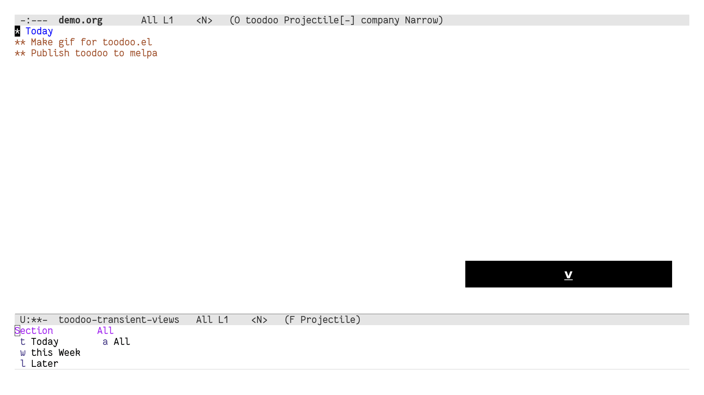
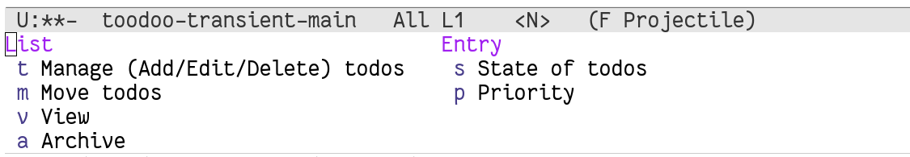

# toodoo

Magit like interface for a simple Todo workflow built on top of Org.



## Workflow

The package serves a simple opinionated Todo management workflow described below.

There are 3 categories of tasks:
1. Today - immediate items to be done in the next 8 hours
2. This Week - current context of items to be kept in mind for this week
3. Later - all other items

By default, only the immediate tasks should be shown to the user. Tasks can be created in any category and moved between them freely. Optionally, tasks can be marked as high priority. Periodically, completed tasks can be archived. (Not immediately after being marked DONE, since you want to see the list of tasks completed that day.)

The aim of the workflow is **simplicity** and **ease of use**. I did manage this with Org-mode, but the process was clunky.

## Usage assumptions

None of these are mandatory, but just to give an idea of how I use this.

1. You have a few (say 1-5) tasks in Today, 5-20 tasks in This Week and any number of tasks in Later.
2. Once/twice a day, you review the list of tasks in This Week and move them to Today.
3. During the day, you capture new tasks directly in Today. Depending on how urgent/important it is, you move it This Week or Later then and there.
4. If the list of tasks in Today grows too long, you move some over to This Week.
5. You mark high priority tasks, to ensure that you don't miss them in the clutter.
6. At the end of the day, you archive all tasks done that day.
7. Occasionally (once/twice a week), you review the tasks in Later and move some to This Week depending on what you want to work on.

## Installation

For now, clone this repo and load:
```
(load <path/to/repo>/toodoo)
```

## Configuration

You need to decide the file to use to store the todos. If nothing is specified, the default `~/orgmode/todo.org` is used.
```
(setq toodoo-main-file "~/orgmode/tasks.org")
```
Note: this folder should exist, but the file should not since `toodoo` creates it with a template.

By default, `toodoo` assumes that you use `evil-mode` (just because of my own preference).
But, this is easy enough to disable:
```
(setq toodoo-evil-base nil)
```
Now, `toodoo` will work with plain Emacs.

Next, you should bind a key to open the `toodoo` list quickly from anywhere. This is what I use:
```
(define-key evil-normal-state-map (kbd ";t") 'toodoo-open-list)
```
Now, I can just hit `;t` and open the `toodoo` list. You can bind `toodoo-open-list` to any keybinding of your choice (non-evil) or just call it directly.

## Usage

Once you open the list, all keybindings are defined as Transients. There is a top level dispatch bound to `h` which shows all other available commands.



In general though, you will probably use the below commands directly.

`Up` and `Down` to navigate the visible Todos. The task under the cursor is called "current task" in the below descriptions.

List Main Operations:
+ `t a` - Add a new todo in the current section (below the current task). Prompts for a title in the minibuffer.
+ `t e` - Edit a todo. Opens a new window, dropping you in plain Orgmode. You can add a description, or any Org feature really - subheadings, tags, clocking etc. When you are done editing a task, use `q` (evil mode, the default) or `C-c q` (plain emacs) to quit cleanly.
+ `t t` - Quickly edit the title alone from the minibuffer.
+ `t k` - Kill a todo. Note: this is permanent, there is no way to get back killed todos. You should use the Archive option `a` below for normal task lifecycle. This is to remove entries that you do not want to work on.

View Operations:
+ `v t` - View Today category. The default. You are expected to spend most of your time here.
+ `v w` - View This Week category.
+ `v l` - View Later category.
+ `v a` - See the full file.

Move Operations:
+ `m t` - Move the current task to Today.
+ `m w` - Move the current task to This Week.
+ `m l` - Move the current task to Later.

(All of these operations don't disturb your current view.)

State Operations:
+ `s s` - Mark the current task as Started.
+ `s b` - Mark the current task as Blocked.
+ `s d` - Mark the current task as Done.
+ `s c` - Clear the state.

By default, all entries are assumed to be Todo, so no special marker is used for this.

Priority Operations:
+ `p p` - Mark current task as High Priority. Task is highlighted.
+ `p r` - Reset the priority.

We only have support for 2 priorities of tasks - high and low.

Archive Operations:
+ `a a` - Archive the current task.
+ `a e` - Archive all DONE tasks (across all categories).

## Design Philosophy

1. Not all of `org-mode`'s features are needed to manage tasks. They are handy, in general, for notes and the like, but for the workflow, they were getting in the way. At the same time, we can build on those so that we can use them if you need to.
2. `org-agenda` is a powerful dashboard for tasks. But, I don't want a dashboard, I need the actual tasks, right there. The philosophy is, **the view of the thing should not be different from the actual underlying thing**. So, in this approach, all the tasks are actually in a single file.
3. Fast and easy access interface. There is only one solution for this: transients from magit.

## Acknowledgements

- How to make an Emacs Minor Mode: https://nullprogram.com/blog/2013/02/06/

## License

Under Apache License 2.0.
